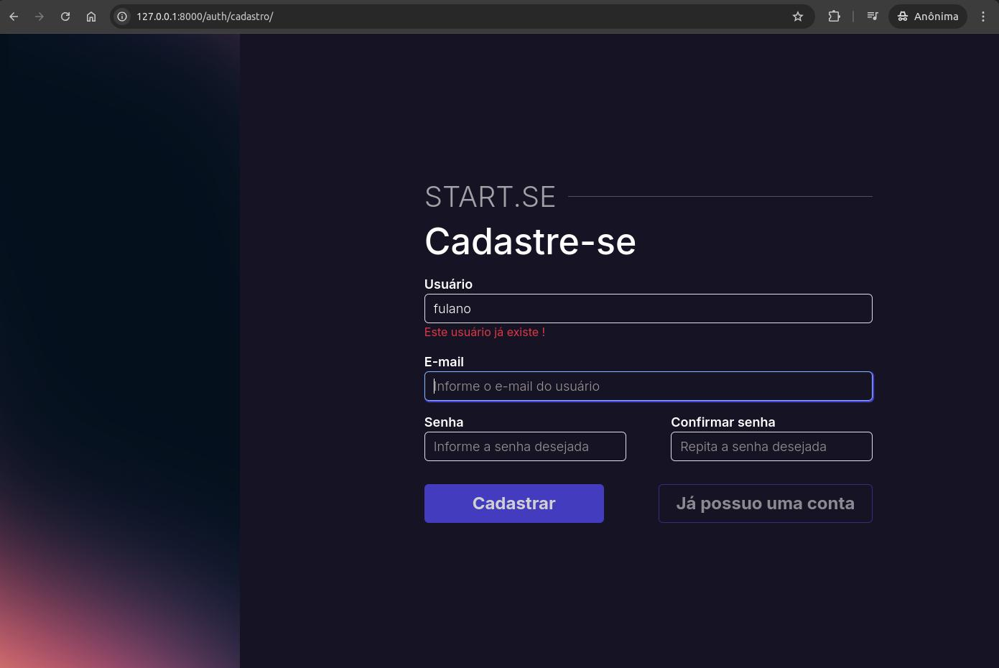
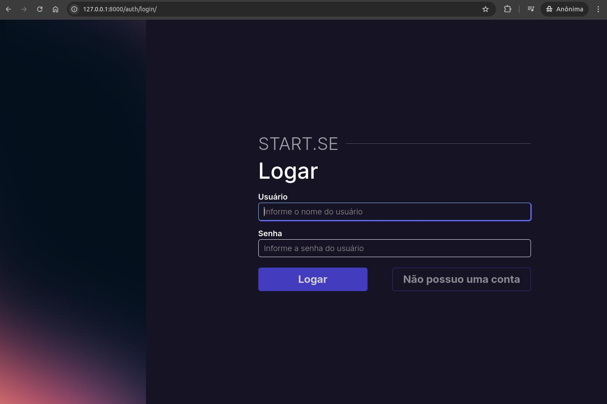
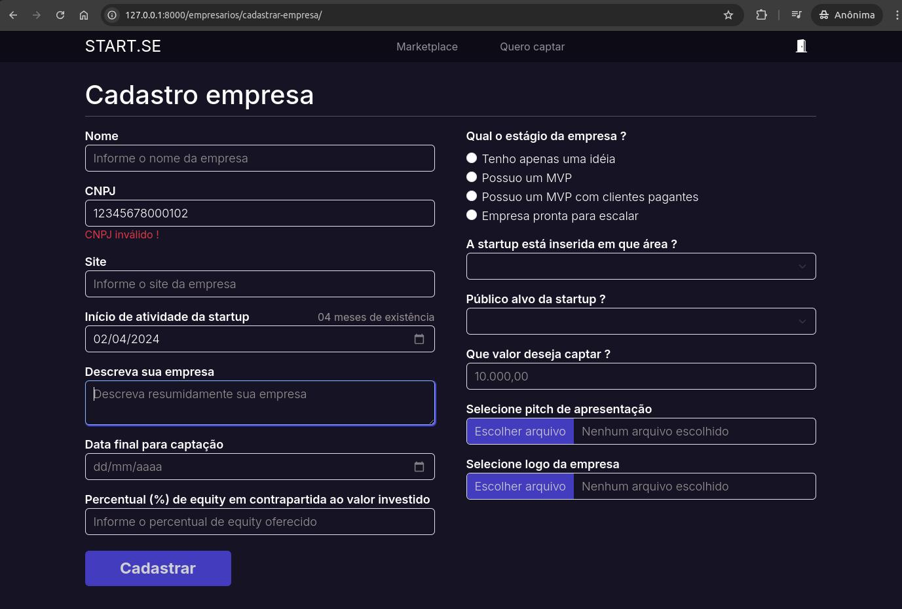
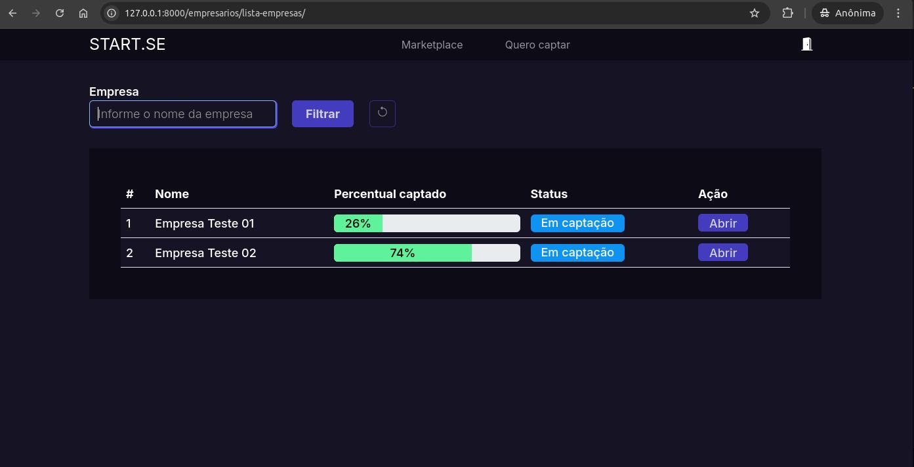

# START.SE

> Projeto desenvolvido na [PSW 11](https://pythonando.com.br "Pythonando").

## Objetivo

    Conectar startups a investidores.

## Sumário

- <a href='#pré-requesitos'>Pré-requisitos</a>
- <a href='#funcionalidades'>Funcionalidades</a>
- <a href='#como-executar-o-projeto'>Como executar o projeto</a>

### Pré-requisitos

    Django, python-decouple e htmx.

### Funcionalidades

- Cadastro de usuários <br>
  
   <br>
- Login do usuário <br>
    
  <br>
- Cadastro empresas <br>
  
   <br>
- Lista empresas <br>
  
  
### Como executar o projeto

```bash
# Clone o projeto
git clone https://github.com/gm-costa/startse_psw11.git

# Renomeie o arquivo .env_sample
# No linux
mv .env_sample .env
# No windows
ren .env_sample .env

# Execute as migrações
python3 manage.py makemigrations && python3 manage.py migrate

# Execute o servidor
python3 manage.py runserver

# Teste o projeto, em um browser digite
http://127.0.0.1:8000

```

---
